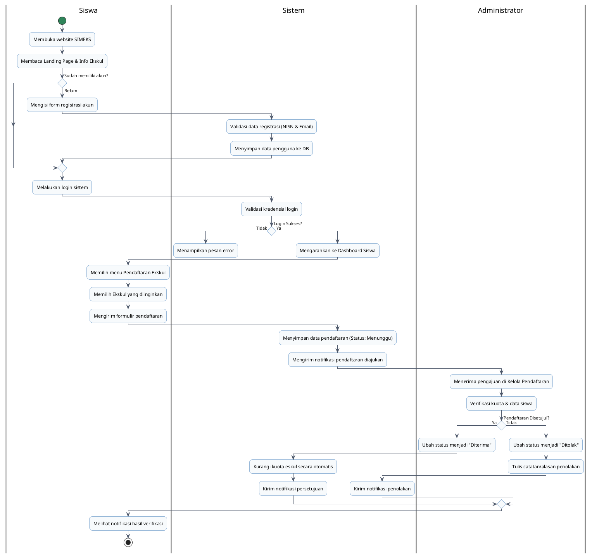
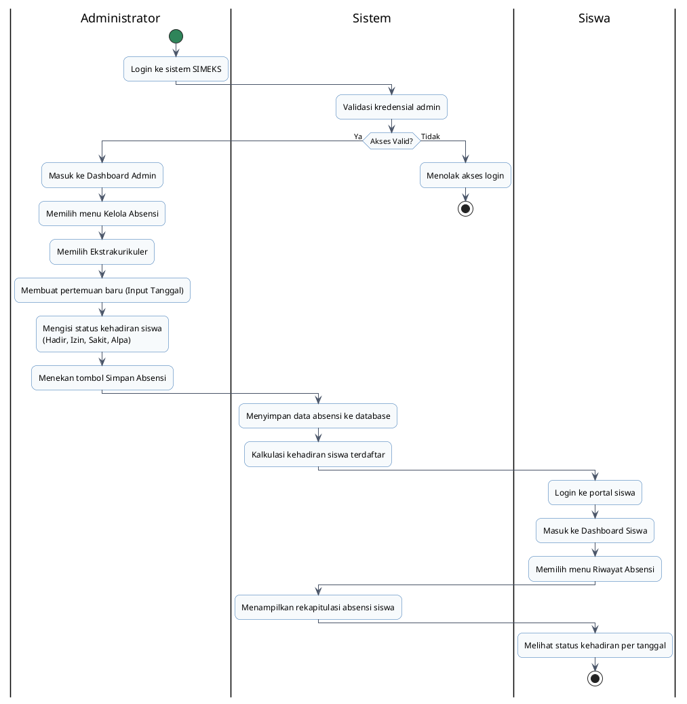

# Dokumentasi & Analisis Activity Diagram SIMEKS
**Sistem Informasi Manajemen Ekstrakurikuler Sekolah (SIMEKS) - SMAN 2 Sukatani**

*Activity diagram* menggambarkan alur kerja (*workflow*) aliran aktivitas dalam suatu proses bisnis sistem dari awal hingga akhir, termasuk keputusan (*decision*), percabangan (*fork*/*join*), dan peran dari masing-masing entitas (menggunakan *swimlane*). 

Dalam skripsi Anda, disarankan untuk membagi alur aktivitas menjadi proses-proses inti agar penjelasan lebih fokus, detail, dan mudah dipahami oleh penguji. Berikut adalah rancangan dua alur aktivitas utama pada aplikasi SIMEKS:

---

## 📊 1. Activity Diagram 1: Registrasi Akun & Pendaftaran Ekstrakurikuler
Diagram ini menggambarkan alur kerja siswa baru mulai dari membuka website, melakukan registrasi, melakukan login, memilih ekstrakurikuler yang diminati, hingga pengajuan tersebut diproses dan divalidasi oleh administrator.

### 📝 Deskripsi Aliran Aktivitas:
1. **Siswa** membuka landing page SIMEKS dan melihat informasi ketersediaan ekstrakurikuler.
2. Jika siswa belum memiliki akun, siswa melakukan **Registrasi** dengan mengisi formulir registrasi. **Sistem** memvalidasi keunikan email dan NISN, lalu menyimpan data tersebut ke basis data.
3. Setelah memiliki akun, siswa melakukan **Login**. Jika data tidak cocok, sistem menampilkan pesan error. Jika sukses, siswa diarahkan ke **Dashboard Siswa**.
4. Siswa mengakses menu ekskul, memilih ekskul yang aktif, lalu menekan tombol daftar.
5. **Sistem** menyimpan data pendaftaran dengan status *default* `menunggu`.
6. **Admin** melihat pengajuan pendaftaran baru di dasbor mereka, melakukan verifikasi dokumen/kuota, kemudian memutuskan untuk menyetujui atau menolak pendaftaran tersebut.
7. **Sistem** memperbarui kuota ekskul (jika disetujui) dan mengirimkan **Notifikasi** real-time ke akun siswa terkait.

### 🖥️ Script PlantUML:

---

## 📊 2. Activity Diagram 2: Penginputan Kehadiran & Pengelolaan Absensi Siswa
Diagram ini menggambarkan alur kerja administrasi rutin sekolah, di mana administrator merekam kehadiran siswa pada setiap pertemuan ekstrakurikuler serta bagaimana siswa dapat memantau kehadiran mereka secara transparan.

### 📝 Deskripsi Aliran Aktivitas:
1. **Admin** melakukan login dan masuk ke **Dashboard Admin**.
2. Admin mengakses menu **Kelola Absensi** dan memilih nama ekstrakurikuler yang akan diinput absensinya.
3. Admin menentukan tanggal pertemuan dan menginput kehadiran siswa terdaftar satu per satu (Hadir, Izin, Sakit, Alpa).
4. **Sistem** menyimpan data kehadiran ke tabel `absensi` dan memperbarui persentase kehadiran masing-masing siswa.
5. **Siswa** melakukan login di portal siswa mereka.
6. Siswa mengakses menu **Absensi** untuk memantau kehadiran dan mengonfirmasi keikutsertaan sesi latihan yang telah berlangsung.

### 🖥️ Script PlantUML:

---

## 🛠️ 3. Cara Menampilkan/Menggenerate Diagram dari Script

Anda dapat mengubah script PlantUML di atas menjadi gambar diagram yang rapi dengan langkah-langkah berikut:

1. **Menggunakan PlantUML Server Resmi (Gratis & Cepat)**:
   * Kunjungi situs **[PlantUML Web Server](http://www.plantuml.com/plantuml/)**.
   * Salin (*Copy*) seluruh kode di dalam blok `@startuml` sampai `@endum` di atas.
   * Tempelkan (*Paste*) ke dalam kolom teks di situs tersebut.
   * Klik tombol **Submit** untuk melihat hasilnya. Anda bisa mengunduh gambarnya dalam format PNG atau SVG.

2. **Menggunakan VS Code Extension**:
   * Pasang ekstensi bernama **PlantUML** oleh *jebbs* di VS Code Anda.
   * Buat file baru dengan ekstensi `.puml` (misal: `activity.puml`), tempelkan script di atas, lalu tekan `Alt + D` untuk melihat pratinjau grafis secara langsung.
