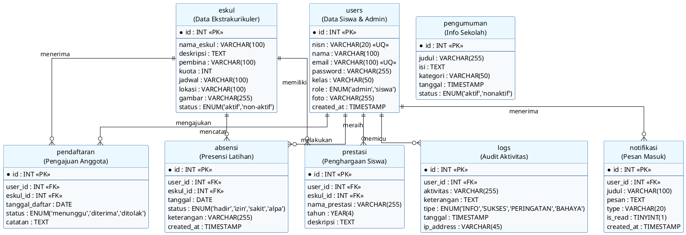

# Dokumentasi & Analisis Entity Relationship Diagram (ERD) SIMEKS
**Sistem Informasi Manajemen Ekstrakurikuler Sekolah (SIMEKS) - SMAN 2 Sukatani**

*Entity Relationship Diagram* (ERD) adalah diagram yang menggambarkan hubungan struktural antar entitas (tabel) di dalam suatu basis data. Dokumentasi ini disusun berdasarkan analisis file database fisik `simeks_db.sql` pada proyek Anda. 

Dalam penulisan skripsi, bagian ini berfungsi untuk memperjelas arsitektur penyimpanan data, kunci utama (*Primary Key*), kunci tamu (*Foreign Key*), serta derajat relasi (*cardinality*) antar entitas.

---

## 📚 1. Kamus Data & Struktur Entitas (Data Dictionary)

Berikut adalah detail struktur tabel yang diimplementasikan pada database `simeks_db`:

### A. Tabel `users` (Menyimpan data Siswa & Admin)
*   **id** (INT, Primary Key, Auto Increment): ID unik pengguna.
*   **nisn** (VARCHAR(20), Unique, Nullable): Nomor Induk Siswa Nasional (hanya untuk siswa).
*   **nama** (VARCHAR(100)): Nama lengkap pengguna.
*   **email** (VARCHAR(100), Unique): Email untuk login.
*   **password** (VARCHAR(255)): Kata sandi (terenkripsi *hash* PHP).
*   **kelas** (VARCHAR(50), Nullable): Kelas siswa.
*   **role** (ENUM('admin', 'siswa')): Hak akses pengguna.
*   **foto** (VARCHAR(255), Default: 'default.png'): Nama file foto profil.
*   **created_at** (TIMESTAMP): Waktu pendaftaran akun.

### B. Tabel `eskul` (Menyimpan data Ekstrakurikuler)
*   **id** (INT, Primary Key, Auto Increment): ID unik ekskul.
*   **nama_eskul** (VARCHAR(100)): Nama ekstrakurikuler.
*   **deskripsi** (TEXT): Deskripsi kegiatan ekskul.
*   **pembina** (VARCHAR(100)): Nama guru pembina ekskul.
*   **kuota** (INT, Default: 30): Batas maksimal anggota.
*   **jadwal** (VARCHAR(100)): Jadwal hari dan jam latihan.
*   **lokasi** (VARCHAR(100)): Lapangan atau ruang latihan.
*   **gambar** (VARCHAR(255)): Nama file gambar eskul.
*   **status** (ENUM('aktif', 'non-aktif')): Status operasional ekskul.

### C. Tabel `pendaftaran` (Transaksi Pendaftaran Ekskul)
*   **id** (INT, Primary Key, Auto Increment): ID unik pendaftaran.
*   **user_id** (INT, Foreign Key -> `users.id`): Referensi ke siswa pendaftar.
*   **eskul_id** (INT, Foreign Key -> `eskul.id`): Referensi ke ekskul yang dipilih.
*   **tanggal_daftar** (DATE): Tanggal pengajuan pendaftaran.
*   **status** (ENUM('menunggu', 'diterima', 'ditolak')): Hasil verifikasi admin.
*   **catatan** (TEXT, Nullable): Alasan jika ditolak atau catatan tambahan.

### D. Tabel `absensi` (Pencatatan Kehadiran Ekskul)
*   **id** (INT, Primary Key, Auto Increment): ID unik absensi.
*   **user_id** (INT, Foreign Key -> `users.id`): Referensi ke siswa.
*   **eskul_id** (INT, Foreign Key -> `eskul.id`): Referensi ke ekskul terkait.
*   **tanggal** (DATE): Tanggal pertemuan ekskul.
*   **status** (ENUM('hadir', 'izin', 'sakit', 'alpa')): Status kehadiran.
*   **keterangan** (VARCHAR(255), Nullable): Alasan jika izin/sakit/alpa.
*   **created_at** (TIMESTAMP): Waktu pencatatan data absensi.

### E. Tabel `prestasi` (Pencatatan Penghargaan Siswa)
*   **id** (INT, Primary Key, Auto Increment): ID unik prestasi.
*   **user_id** (INT, Foreign Key -> `users.id`): Referensi ke siswa peraih prestasi.
*   **eskul_id** (INT, Foreign Key -> `eskul.id`): Referensi ke ekskul asal prestasi.
*   **nama_prestasi** (VARCHAR(255)): Nama penghargaan (misal: "Juara 1 Futsal Cup").
*   **tahun** (YEAR(4)): Tahun pencapaian prestasi.
*   **deskripsi** (TEXT): Deskripsi/detail prestasi.

### F. Tabel `notifikasi` (Pemberitahuan Sistem ke Siswa)
*   **id** (INT, Primary Key, Auto Increment): ID unik notifikasi.
*   **user_id** (INT, Foreign Key -> `users.id`): Penerima notifikasi.
*   **judul** (VARCHAR(100)): Judul notifikasi.
*   **pesan** (TEXT): Isi notifikasi.
*   **type** (VARCHAR(20), Default: 'info'): Kategori tampilan notifikasi.
*   **is_read** (TINYINT(1), Default: 0): Status dibaca (0 = belum, 1 = sudah).
*   **created_at** (TIMESTAMP): Waktu notifikasi terkirim.

### G. Tabel `logs` (Rekam Aktivitas Keamanan Sistem)
*   **id** (INT, Primary Key, Auto Increment): ID unik log.
*   **user_id** (INT, Foreign Key -> `users.id`): Referensi pelaku aktivitas.
*   **aktivitas** (VARCHAR(255)): Ringkasan aktivitas (misal: "Login Berhasil").
*   **keterangan** (TEXT): Keterangan detail.
*   **tipe** (ENUM('INFO', 'SUKSES', 'PERINGATAN', 'BAHAYA')): Level audit log.
*   **tanggal** (TIMESTAMP): Waktu terjadinya aktivitas.
*   **ip_address** (VARCHAR(45)): IP address perangkat pengguna.

### H. Tabel `pengumuman` (Informasi Publik)
*   **id** (INT, Primary Key, Auto Increment): ID unik pengumuman.
*   **judul** (VARCHAR(255)): Judul pengumuman.
*   **isi** (TEXT): Isi pengumuman lengkap.
*   **kategori** (VARCHAR(50)): Kategori pengumuman (misal: "EVENT", "UMUM").
*   **tanggal** (TIMESTAMP): Waktu rilis pengumuman.
*   **status** (ENUM('aktif', 'nonaktif')): Status tampilan pengumuman.

---

## 🔗 2. Analisis Relasi & Kardinalitas (Relationship)

Relasi antar entitas menggunakan relasi relasional SQL standar dengan batasan integritas referensial (*Cascading Rules*):

1.  **Users ke Pendaftaran (1:N)**: Satu user (dengan role siswa) dapat melakukan banyak pendaftaran ekskul seiring berjalannya waktu, namun setiap satu baris pendaftaran hanya dikaitkan dengan satu user.
2.  **Eskul ke Pendaftaran (1:N)**: Satu ekstrakurikuler dapat menerima banyak pendaftaran dari siswa berbeda.
3.  **Users ke Absensi (1:N)**: Satu user (siswa) dapat memiliki banyak catatan absensi harian.
4.  **Eskul ke Absensi (1:N)**: Satu ekstrakurikuler memiliki banyak catatan absensi sesuai jumlah pertemuan latihan.
5.  **Users ke Prestasi (1:N)**: Satu user (siswa) dapat meraih banyak prestasi.
6.  **Eskul ke Prestasi (1:N)**: Satu ekstrakurikuler dapat menyumbangkan banyak catatan prestasi bagi sekolah.
7.  **Users ke Notifikasi (1:N)**: Satu user dapat menerima banyak notifikasi dari sistem.
8.  **Users ke Logs (1:N)**: Satu user dapat memicu banyak log aktivitas keamanan di sistem.
9.  **Pengumuman (Entitas Independen)**: Berdiri sendiri dan tidak memiliki relasi kunci tamu (*Foreign Key*) langsung dengan tabel lain.

---

## 📊 3. Script PlantUML ERD (Crow's Foot Notation)

Berikut adalah script PlantUML untuk menghasilkan ERD dengan notasi kaki gagak (*Crow's Foot*) yang rapi dan estetik:

---

## 🛠️ 4. Cara Menampilkan/Menggenerate Diagram dari Script

Anda dapat dengan mudah mengubah script PlantUML di atas menjadi gambar diagram ERD dengan langkah-langkah berikut:

1. **Menggunakan PlantUML Server Resmi (Gratis & Cepat)**:
   * Kunjungi situs **[PlantUML Web Server](http://www.plantuml.com/plantuml/)**.
   * Salin (*Copy*) seluruh kode di dalam blok `@startuml` sampai `@endum` di atas.
   * Tempelkan (*Paste*) ke dalam kolom teks di situs tersebut.
   * Klik tombol **Submit** untuk melihat hasilnya. Anda bisa mengunduh gambarnya dalam format PNG atau SVG.

2. **Menggunakan VS Code Extension**:
   * Pasang ekstensi bernama **PlantUML** oleh *jebbs* di VS Code Anda.
   * Buat file baru dengan ekstensi `.puml` (misal: `erd.puml`), tempelkan script di atas, lalu tekan `Alt + D` untuk melihat pratinjau grafis secara langsung.
