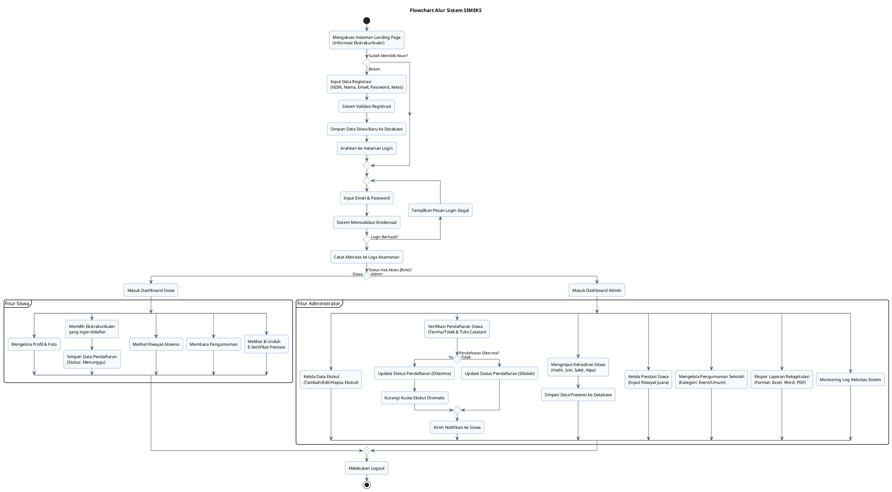

# Dokumentasi & Rancangan Flowchart SIMEKS
**Sistem Informasi Manajemen Ekstrakurikuler Sekolah (SIMEKS) - SMAN 2 Sukatani**

*Flowchart* (diagram alir) adalah diagram yang menggambarkan langkah-langkah sistematis dari suatu algoritma atau alur proses logika program. Berbeda dengan *activity diagram* yang berfokus pada pembagian peran (siapa melakukan apa), *flowchart* berfokus pada detail urutan instruksi, keputusan percabangan, serta input/output data dalam aplikasi SIMEKS dari awal hingga akhir.

---

## 📊 1. Alur Logika Flowchart Sistem

Berikut adalah alur logika yang digambarkan dalam diagram alir sistem SIMEKS secara keseluruhan:

1. **Mulai (Start)**: Pengguna mengakses website SIMEKS.
2. **Landing Page**: Menampilkan informasi umum dan daftar ekstrakurikuler yang aktif.
3. **Pemeriksaan Akun (Decision)**: Apakah pengguna sudah terdaftar?
   * Jika **Belum**, pengguna masuk ke form **Registrasi Akun**, menginput NISN, nama, email, password, kelas, lalu menekan daftar. Sistem menyimpan data ke DB, lalu diarahkan ke halaman login.
   * Jika **Sudah**, lanjut ke **Halaman Login**.
4. **Verifikasi Login (Decision)**: Pengguna menginput email dan password. 
   * Jika **Gagal**, sistem menampilkan pesan error dan pengguna harus login ulang.
   * Jika **Berhasil**, sistem memeriksa hak akses (role) pengguna.
5. **Pemeriksaan Role (Decision)**:
   * Jika **Role = Siswa**: Masuk ke **Dashboard Siswa**.
     * Siswa dapat memilih beberapa menu: *Update Profil/Foto*, *Pengajuan Pendaftaran Ekskul*, *Melihat Riwayat Absensi*, *Membaca Pengumuman*, dan *Mengunduh E-Sertifikat Prestasi*.
   * Jika **Role = Admin**: Masuk ke **Dashboard Admin**.
     * Admin dapat mengelola menu: *CRUD Data Ekskul*, *Verifikasi Pendaftaran Anggota Baru*, *Input Absensi Kehadiran*, *Input Prestasi Siswa*, *Posting Pengumuman*, *Monitoring Logs Audit*, dan *Ekspor Laporan (Excel/Word/PDF)*.
6. **Selesai (End)**: Pengguna melakukan logout dari sistem.

---

## 🖥️ 2. Script PlantUML Flowchart

Berikut adalah script **PlantUML** untuk menghasilkan Flowchart Sistem SIMEKS secara lengkap, rapi, dan menggunakan representasi warna modern:

---

## 🛠️ 3. Cara Menampilkan/Menggenerate Diagram dari Script

Anda dapat mengonversi script PlantUML di atas menjadi gambar diagram yang rapi dengan langkah-langkah berikut:

1. **Menggunakan PlantUML Server Resmi (Gratis & Cepat)**:
   * Kunjungi situs **[PlantUML Web Server](http://www.plantuml.com/plantuml/)**.
   * Salin (*Copy*) seluruh kode di dalam blok `@startuml` sampai `@endum` di atas.
   * Tempelkan (*Paste*) ke dalam kolom teks di situs tersebut.
   * Klik tombol **Submit** untuk melihat hasilnya. Anda bisa mengunduh gambarnya dalam format PNG atau SVG.

2. **Menggunakan VS Code Extension**:
   * Pasang ekstensi bernama **PlantUML** oleh *jebbs* di VS Code Anda.
   * Buat file baru dengan ekstensi `.puml` (misal: `flowchart.puml`), tempelkan script di atas, lalu tekan `Alt + D` untuk melihat pratinjau grafis secara langsung.
