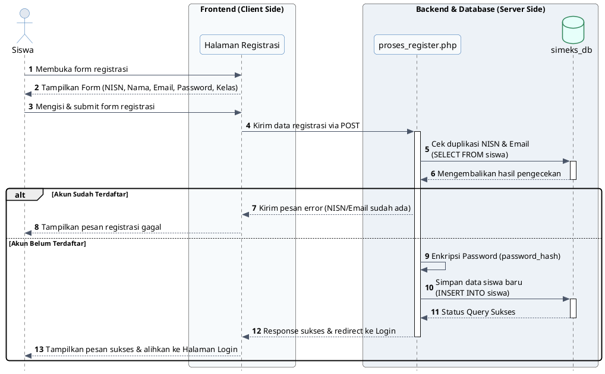
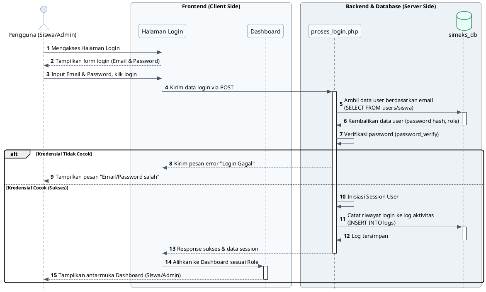
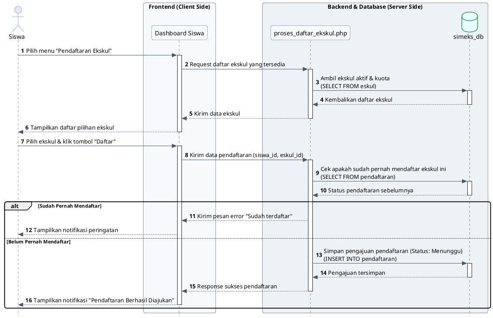
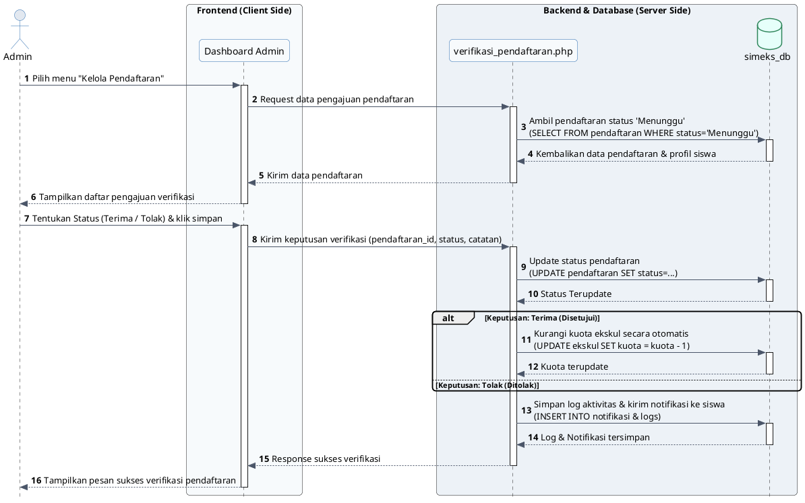
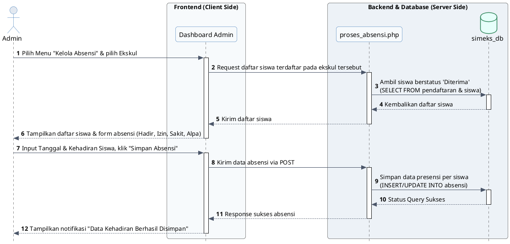
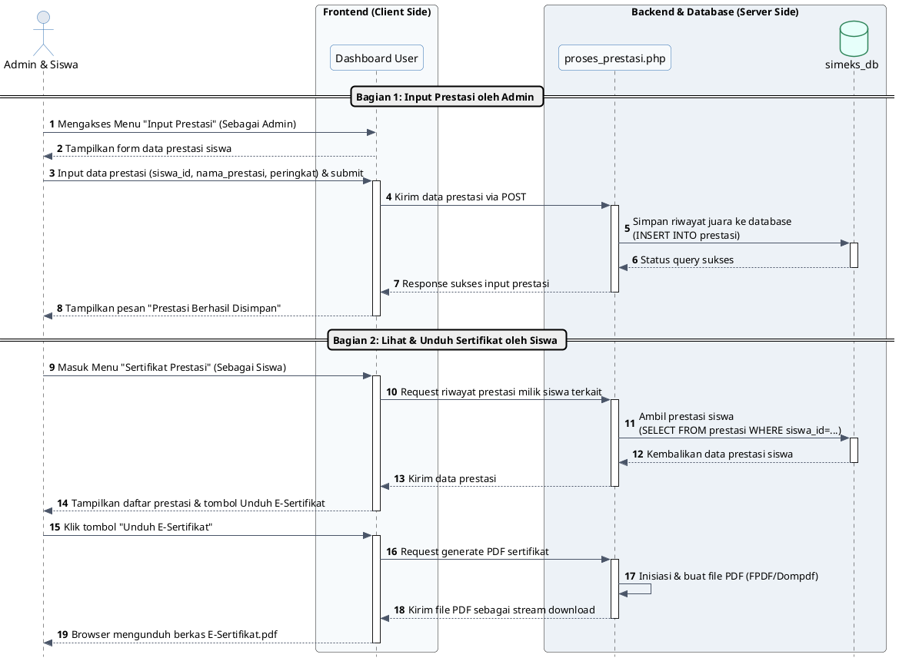
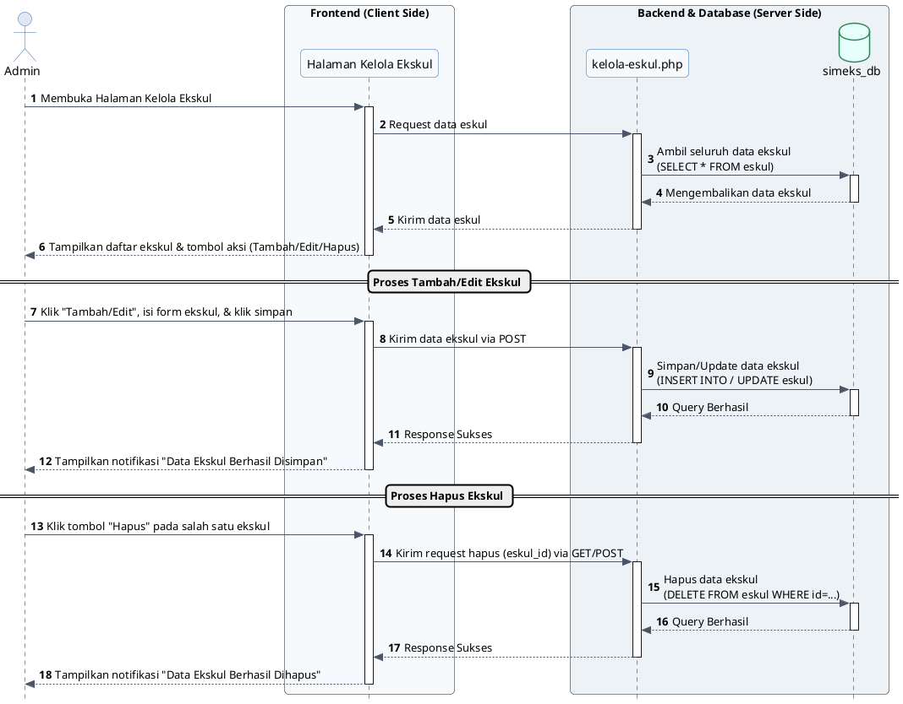
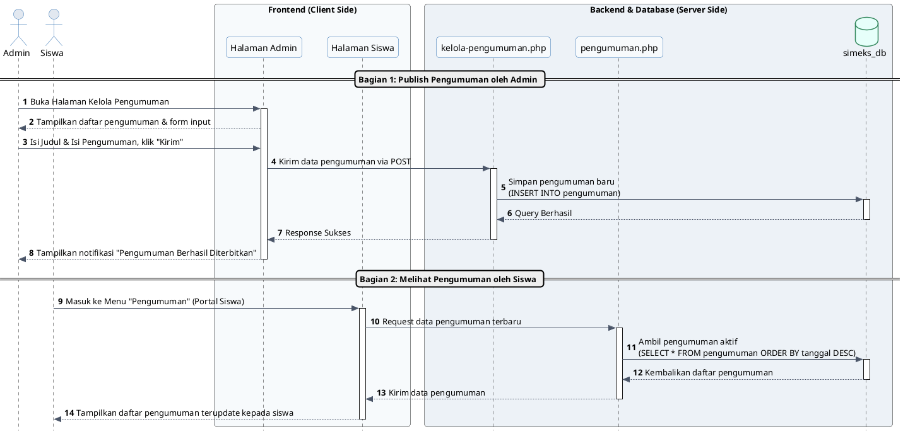
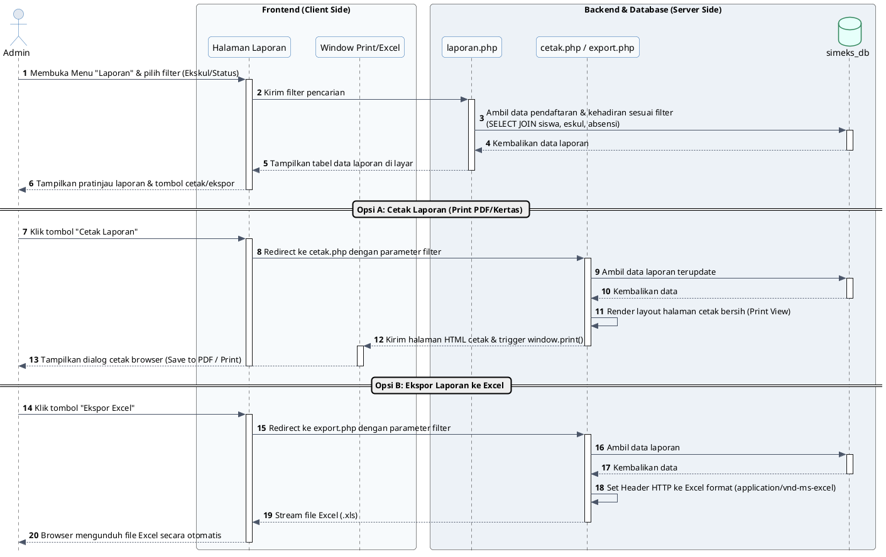
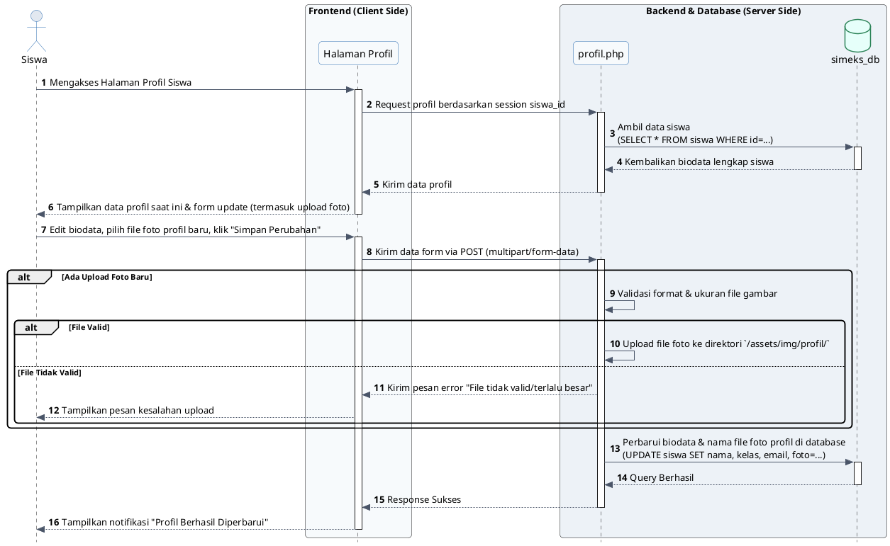

# Dokumentasi & Perancangan Sequence Diagram SIMEKS
**Sistem Informasi Manajemen Ekstrakurikuler Sekolah (SIMEKS) - SMAN 2 Sukatani**

*Sequence diagram* (diagram sekuens) adalah jenis diagram interaksi yang menjelaskan bagaimana objek-objek dalam sistem berkolaborasi dan berkomunikasi satu sama lain berdasarkan urutan waktu (kronologis). Diagram ini berfokus pada aliran pesan (*messages*) yang dikirimkan antara *actor*, *boundary/view* (antarmuka), *control* (proses logika backend), dan *entity* (tabel database).

Untuk skripsi Anda, perancangan diagram sekuens dibagi menjadi **4 skenario utama** yang merepresentasikan proses inti dari aplikasi SIMEKS:

---

## 📊 1. Sequence Diagram: Registrasi Akun Siswa
Menjelaskan proses saat siswa baru mendaftarkan akun ke dalam sistem agar datanya tercatat dan mendapatkan hak akses untuk masuk ke portal siswa.

### 🖥️ Script PlantUML

---

## 📊 2. Sequence Diagram: Login Pengguna (Siswa & Admin)
Menjelaskan proses otentikasi kredensial pengguna (email & password) dan bagaimana sistem menentukan hak akses (*role*) untuk mengarahkan pengguna ke dasbor yang sesuai.

### 🖥️ Script PlantUML

---

## 📊 3. Sequence Diagram: Pendaftaran Ekstrakurikuler oleh Siswa
Menjelaskan interaksi objek ketika seorang siswa memilih salah satu ekstrakurikuler yang aktif dan mengajukan pendaftaran ke sistem.

### 🖥️ Script PlantUML

---

## 📊 4. Sequence Diagram: Verifikasi Pendaftaran oleh Admin
Menjelaskan bagaimana administrator melakukan verifikasi (menyetujui atau menolak) pengajuan pendaftaran siswa baru, yang berdampak pada otomatisasi pengurangan kuota ekstrakurikuler.

### 🖥️ Script PlantUML

---

## 📊 5. Sequence Diagram: Penginputan Absensi Kehadiran (Oleh Admin)
Menjelaskan bagaimana administrator melakukan pencatatan kehadiran (presensi) untuk siswa yang telah resmi terdaftar pada suatu ekstrakurikuler.

### 🖥️ Script PlantUML

---

## 📊 6. Sequence Diagram: Pencatatan Prestasi & Unduh E-Sertifikat
Menjelaskan alur saat administrator menginput prestasi kejuaraan siswa, serta bagaimana siswa dapat melihat dan mengunduh E-Sertifikat Prestasi dalam format PDF.

### 🖥️ Script PlantUML

---

## 📊 7. Sequence Diagram: Pengelolaan Data Ekstrakurikuler (CRUD oleh Admin)
Menjelaskan bagaimana administrator mengelola data ekstrakurikuler (tambah, edit, dan hapus data) yang terhubung ke database.

### 🖥️ Script PlantUML

---

## 📊 8. Sequence Diagram: Pengelolaan & Penayangan Pengumuman
Menjelaskan alur saat admin memposting pengumuman baru hingga pengumuman tersebut tampil pada halaman pengumuman di portal siswa.

### 🖥️ Script PlantUML

---

## 📊 9. Sequence Diagram: Pembuatan Laporan & Cetak/Ekspor Data oleh Admin
Menjelaskan bagaimana administrator melakukan penyaringan (filtering) data pendaftaran dan kehadiran untuk dicetak (PDF) atau diekspor ke Microsoft Excel.

### 🖥️ Script PlantUML

---

## 📊 10. Sequence Diagram: Pembaruan Profil & Foto Siswa
Menjelaskan alur saat siswa memperbarui data pribadi dan mengunggah foto profil baru yang disimpan ke direktori aset server dan database.

### 🖥️ Script PlantUML

---

## 🛠️ Cara Menggenerate/Membuka Diagram dari Script
Anda dapat melihat tampilan grafis dari script PlantUML di atas dengan langkah-langkah berikut:
1. **Salin Script**: Copy script di dalam blok `@startuml` sampai `@enduml` pada skenario yang ingin Anda buat.
2. **Buka PlantUML Web Server**: Kunjungi website **[PlantUML Web Server](http://www.plantuml.com/plantuml/)**.
3. **Tempel & Submit**: Paste script yang telah disalin ke kolom teks yang disediakan, lalu klik **Submit**. Anda bisa mengunduh hasilnya dalam format `.png` atau `.svg` berkualitas tinggi untuk disisipkan langsung ke dokumen skripsi Anda.

