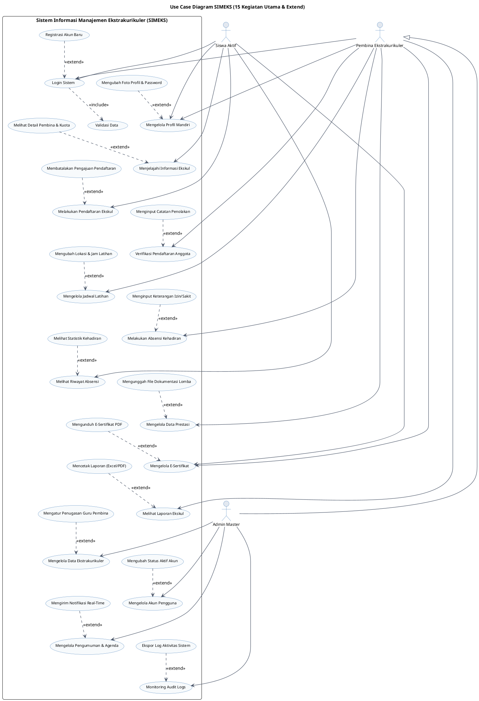

# Dokumentasi & Perancangan Use Case Diagram SIMEKS
**Sistem Informasi Manajemen Ekstrakurikuler Sekolah (SIMEKS) - SMAN 2 Sukatani**

Dokumen ini berisi rancangan **Use Case Diagram** dan **Skenario Use Case** untuk sistem SIMEKS yang telah disederhanakan menjadi **15 Kegiatan Utama (Base Use Case)** beserta hubungannya dengan **Use Case Perluasan (Extend Use Case)**. Rancangan ini disesuaikan dengan kebutuhan revisi skripsi dan implementasi kodingan di dalam aplikasi.

---

## 👥 1. Identifikasi Aktor Sistem (Actors Definition)
Sistem SIMEKS memiliki 3 (tiga) aktor utama yang berinteraksi dengan sistem dengan hak akses (RBAC - *Role-Based Access Control*) yang berbeda:

| No | Aktor | Deskripsi Peran (Role) |
| :--- | :--- | :--- |
| 1 | **Siswa Aktif** | Pengguna yang dapat menjelajahi ekskul, mendaftar ekskul, melihat riwayat kehadiran pribadi, dan mengunduh E-Sertifikat Prestasi miliknya. |
| 2 | **Pembina Ekstrakurikuler** | Guru pembina yang mengelola absensi latihan, menginput prestasi siswa, memverifikasi pendaftaran anggota baru, dan mencetak laporan khusus untuk ekskul binaannya. |
| 3 | **Admin Master** | Administrator sistem utama yang memiliki hak penuh (full access) atas seluruh data sekolah. Mengelola data master eskul, data pembina/siswa, pengumuman, logs audit, dan mewarisi hak akses Pembina. |

---

## 🗺️ 2. Pemetaan 15 Kegiatan Utama & Relasi Extend
Berikut adalah pemetaan fungsionalitas sistem SIMEKS ke dalam **15 Kegiatan Utama (Base Use Case)** beserta relasi perluasan opsional (**Extend Use Case**):

| No | Kegiatan Utama (Base Use Case) | Aktor Utama | Use Case Perluasan (Extend Use Case) | Keterangan Hubungan Extend |
| :--- | :--- | :--- | :--- | :--- |
| 1 | **Login Sistem** | Siswa, Pembina, Admin | **Registrasi Akun Baru** | Siswa baru dapat melakukan registrasi secara mandiri jika belum memiliki akun untuk login. |
| 2 | **Mengelola Profil Mandiri** | Siswa, Pembina, Admin | **Mengubah Foto Profil & Password** | Pengguna dapat memperbarui foto profil dan password mereka secara opsional di halaman profil. |
| 3 | **Menjelajahi Informasi Ekskul** | Siswa Aktif | **Melihat Detail Pembina & Kuota** | Siswa dapat secara opsional melihat info sisa kuota dan kontak pembina saat melihat daftar ekskul. |
| 4 | **Melakukan Pendaftaran Ekskul**| Siswa Aktif | **Membatalkan Pengajuan Pendaftaran**| Siswa dapat membatalkan pengajuan sebelum status pendaftarannya diverifikasi pembina. |
| 5 | **Verifikasi Pendaftaran Anggota**| Pembina, Admin | **Menginput Catatan Penolakan** | Pembina wajib menginput catatan/alasan penolakan jika status pendaftaran siswa ditolak. |
| 6 | **Mengelola Jadwal Latihan** | Pembina, Admin | **Mengubah Lokasi & Jam Latihan** | Pembina dapat memperbarui jam atau lokasi latihan jika ada perubahan mendadak. |
| 7 | **Melakukan Absensi Kehadiran** | Pembina, Admin | **Menginput Keterangan Izin/Sakit** | Pembina menginput alasan khusus jika siswa tidak hadir latihan. |
| 8 | **Melihat Riwayat Absensi** | Siswa Aktif | **Melihat Statistik Kehadiran** | Siswa melihat grafik persentase kehadirannya dalam bentuk doughnut chart. |
| 9 | **Mengelola Data Prestasi** | Pembina, Admin | **Mengunggah File Dokumentasi Lomba**| Pembina dapat mengunggah bukti foto dokumentasi piala/juara secara opsional. |
| 10 | **Mengelola E-Sertifikat** | Siswa, Pembina, Admin | **Mengunduh E-Sertifikat PDF** | Siswa dapat secara mandiri mengunduh e-sertifikat prestasi mereka dalam format PDF. |
| 11 | **Melihat Laporan Ekskul** | Pembina, Admin | **Mencetak Laporan (Excel/PDF)** | Aktor dapat mengekspor/mencetak rekap data kehadiran/anggota ke Excel atau PDF. |
| 12 | **Mengelola Data Ekstrakurikuler**| Admin Master | **Mengatur Penugasan Guru Pembina**| Admin menghubungkan akun pembina ke ekskul terkait saat membuat/mengedit data ekskul. |
| 13 | **Mengelola Akun Pengguna** | Admin Master | **Mengubah Status Aktif Akun** | Admin dapat menonaktifkan atau mengaktifkan kembali akun pembina/siswa yang bermasalah. |
| 14 | **Mengelola Pengumuman & Agenda**| Admin Master | **Mengirim Notifikasi Real-Time** | Admin dapat mengirimkan notifikasi instan ke portal siswa saat merilis pengumuman baru. |
| 15 | **Monitoring Audit Logs** | Admin Master | **Ekspor Log Aktivitas Sistem** | Admin mengekspor riwayat log aktivitas keamanan sistem untuk kebutuhan pengarsipan. |

---

## 📋 3. Kamus Use Case (Use Case Dictionary)

Kamus ini menjelaskan fungsi prosedural dari 15 Kegiatan Utama di dalam sistem SIMEKS:

1. **Login Sistem**: Proses otentikasi kredensial pengguna (email/username dan password) untuk masuk ke dashboard. *(Meng-include: Validasi Data)*.
2. **Mengelola Profil Mandiri**: Fitur untuk melihat biodata pribadi akun yang sedang aktif.
3. **Menjelajahi Informasi Ekskul**: Portal siswa untuk mencari dan melihat seluruh program ekstrakurikuler yang ditawarkan di SMAN 2 Sukatani.
4. **Melakukan Pendaftaran Ekskul**: Proses siswa mengirimkan formulir pengajuan diri bergabung menjadi anggota ekskul aktif.
5. **Verifikasi Pendaftaran Anggota**: Aksi Pembina/Admin untuk menentukan status penerimaan calon anggota eskul (`diterima` atau `ditolak`).
6. **Mengelola Jadwal Latihan**: Menginput dan mengatur waktu pertemuan berkala untuk latihan rutin eskul.
7. **Melakukan Absensi Kehadiran**: Pencatatan presensi kehadiran siswa terdaftar di setiap pertemuan latihan (Hadir, Sakit, Izin, Alpa).
8. **Melihat Riwayat Absensi**: Halaman siswa untuk memantau rekap absensi kehadiran dirinya sendiri.
9. **Mengelola Data Prestasi**: Penginputan data kemenangan, kejuaraan, atau penghargaan yang didapatkan oleh siswa/ekskul terkait.
10. **Mengelola E-Sertifikat**: Halaman repositori sertifikat digital siswa atas prestasi yang dicapai.
11. **Melihat Laporan Ekskul**: Fitur pengelola untuk memantau visualisasi rekap kehadiran latihan dan statistik anggota eskul.
12. **Mengelola Data Ekstrakurikuler**: CRUD (Create, Read, Update, Delete) informasi eskul sekolah oleh administrator.
13. **Mengelola Akun Pengguna**: CRUD akun Guru Pembina, Siswa, dan Admin pendukung oleh Administrator Master.
14. **Mengelola Pengumuman & Agenda**: Fitur untuk mempublikasikan berita penting sekolah atau jadwal agenda besar eskul.
15. **Monitoring Audit Logs**: Rekaman jejak audit aktivitas yang terjadi pada database demi keamanan aplikasi.

---

## 📝 4. Skenario Use Case Utama (Detailed Scenarios)

Berikut adalah beberapa skenario fungsionalitas utama yang dapat dicantumkan pada bab pembahasan skripsi Anda:

### Skenario 1: Melakukan Pendaftaran Ekskul (Base Use Case 4)
*   **Aktor**: Siswa Aktif
*   **Alur Utama**:
    1. Siswa masuk ke menu "Daftar Ekskul".
    2. Siswa mencari ekstrakurikuler yang diminati.
    3. Siswa menekan tombol "Daftar" dan sistem menyimpan status awal `Menunggu`.
*   **Alur Perluasan (Extend - Membatalkan Pengajuan)**:
    1. Sebelum pembina menyetujui, siswa mengakses menu dashboard.
    2. Siswa menekan opsi "Batalkan" pada riwayat pendaftaran.
    3. Sistem menghapus pengajuan dari database.

### Skenario 2: Melihat Laporan Ekskul & Cetak Laporan (Base Use Case 11)
*   **Aktor**: Pembina Ekstrakurikuler, Admin Master
*   **Alur Utama**:
    1. Aktor mengakses menu "Laporan".
    2. Sistem memuat grafik tren kehadiran latihan dan keaktifan anggota.
*   **Alur Perluasan (Extend - Mencetak Laporan)**:
    1. Aktor memilih tombol "Cetak PDF" atau "Ekspor Excel".
    2. Sistem mengekspor berkas rekap absensi bulanan ke format yang dipilih pengguna.

---

## 📊 5. Script PlantUML Use Case Diagram (Vertical Layout)

Salin kode di bawah ini ke editor **[PlantUML Web Server](http://www.plantuml.com/plantuml/)** untuk menghasilkan diagram secara otomatis dengan format vertikal:

