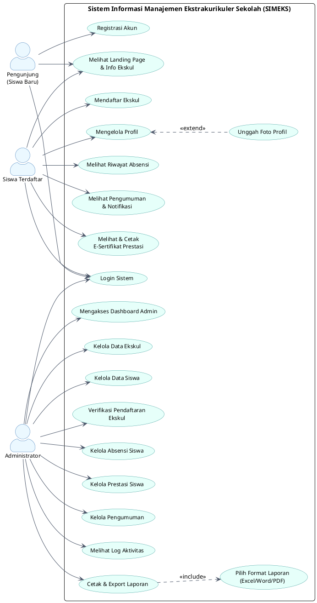

# Dokumentasi & Analisis Use Case SIMEKS
**Sistem Informasi Manajemen Ekstrakurikuler Sekolah (SIMEKS) - SMAN 2 Sukatani**

Dokumen ini berisi analisis detail mengenai aktor (peran) dan *use case* (fungsionalitas) yang berjalan di dalam aplikasi SIMEKS berdasarkan analisis struktur database (`simeks_db.sql`) dan kode halaman (`admin/` dan `siswa/`). 

Di bagian akhir dokumen ini, terdapat rancangan script **PlantUML Use Case Diagram** yang rapi, profesional, dan siap pakai untuk digenerate menjadi gambar diagram.

---

## 👥 1. Analisis Aktor (Actors)

Berdasarkan analisis file login, registrasi, dan session, terdapat **3 aktor utama** yang berinteraksi dengan sistem SIMEKS:

| No | Nama Aktor | Deskripsi |
| :--- | :--- | :--- |
| 1 | **Pengunjung (Siswa Baru)** | Siswa yang belum memiliki akun. Aktor ini hanya dapat melihat halaman utama (landing page), melihat detail ekstrakurikuler yang tersedia, melakukan registrasi akun, dan mengakses halaman login. |
| 2 | **Siswa Terdaftar** | Siswa yang telah memiliki akun dan berhasil login. Aktor ini dapat mendaftar kegiatan ekskul secara online, mengelola profil pribadi, memantau kehadiran (absensi), melihat pengumuman, serta melihat & mengunduh E-Sertifikat prestasi. |
| 3 | **Administrator (Admin)** | Pengelola sistem utama (sekolah/pembina utama). Aktor ini memiliki hak akses penuh untuk mengelola master data eskul, data siswa, memverifikasi pendaftaran, menginput absensi, mengelola pengumuman & prestasi, memantau log keamanan, dan mengekspor laporan. |

---

## 🎯 2. Deskripsi Fungsionalitas (*Use Cases*)

Berikut adalah daftar fungsionalitas yang dikelompokkan berdasarkan aktor yang dapat mengaksesnya:

### A. Fungsionalitas Umum & Autentikasi
*   **Registrasi Akun**: Siswa baru membuat akun dengan mengisi data NISN, Nama, Email, Kelas, dan Password.
*   **Login Sistem**: Pengguna (Siswa/Admin) memverifikasi identitas untuk masuk ke dashboard yang sesuai.
*   **Melihat Landing Page & Info Ekskul**: Pengguna dapat melihat informasi ekskul (Nama Ekskul, Deskripsi, Jadwal, Lokasi, Pembina, Sisa Kuota).

### B. Fungsionalitas Siswa (Siswa Terdaftar)
*   **Mengelola Profil**: Siswa dapat memperbarui data biodata diri.
    *   *<<extend>>* **Unggah Foto Profil**: Siswa dapat mengganti foto profil mereka.
*   **Mendaftar Ekskul**: Siswa memilih ekskul yang aktif dan mengajukan pendaftaran. Status pendaftaran default adalah 'menunggu' sebelum diproses oleh Admin.
*   **Melihat Riwayat Absensi**: Siswa melihat kehadiran mereka (Hadir, Izin, Sakit, Alpa) per kegiatan eskul.
*   **Melihat Pengumuman & Notifikasi**: Siswa menerima update kegiatan dan status pendaftaran.
*   **Melihat & Cetak E-Sertifikat Prestasi**: Siswa dapat mengunduh sertifikat prestasi dalam format PDF apabila datanya telah diinput oleh admin.

### C. Fungsionalitas Administrator (Admin)
*   **Mengakses Dashboard Admin**: Memantau statistik total siswa, jumlah ekskul aktif, pengajuan pendaftaran masuk, dan log aktivitas terbaru.
*   **Kelola Data Ekskul**: Operasi CRUD (Create, Read, Update, Delete) pada tabel `eskul` (mengatur pembina, jadwal, lokasi, kuota, status aktif/non-aktif).
*   **Kelola Data Siswa**: Memantau siswa yang terdaftar dan menghapus/mengedit akun siswa bila diperlukan.
*   **Verifikasi Pendaftaran Ekskul**: Menolak atau menerima pengajuan pendaftaran ekskul oleh siswa.
*   **Kelola Absensi Siswa**: Memilih pertemuan ekskul dan menginput status kehadiran siswa (Hadir, Izin, Sakit, Alpa).
*   **Kelola Prestasi Siswa**: Menginput prestasi yang diraih oleh siswa pada ekskul tertentu.
*   **Kelola Pengumuman**: Membuat pengumuman berdasarkan kategori (Event, Info Umum, dll).
*   **Melihat Log Aktivitas**: Melacak seluruh aktivitas penting sistem (Upaya login gagal, ekspor laporan, update profil, dll) untuk keperluan audit keamanan data.
*   **Cetak & Export Laporan**: Mengunduh data rekapitulasi sistem.
    *   *<<include>>* **Pilih Format Laporan (Excel/Word/PDF)**: Laporan dapat diekspor sesuai format yang diinginkan admin.

---

## 📊 3. Script PlantUML Use Case Diagram

Berikut adalah script **PlantUML** untuk menghasilkan Diagram Use Case yang rapi, terstruktur, dan memiliki estetika visual premium (dilengkapi dengan warna yang harmonis dan format standard UML):

---

## 🛠️ 4. Cara Menampilkan/Menggenerate Diagram dari Script

Kamu dapat dengan mudah mengubah script di atas menjadi gambar diagram yang rapi dengan beberapa opsi berikut:

1. **Menggunakan PlantUML Server Resmi (Gratis & Cepat)**:
   * Kunjungi situs **[PlantUML Web Server](http://www.plantuml.com/plantuml/)**.
   * Salin (Copy) seluruh kode di dalam blok `@startuml` sampai `@endum` di atas.
   * Tempelkan (Paste) ke dalam kolom teks di situs tersebut.
   * Klik tombol **Submit** untuk melihat hasilnya. Kamu bisa mengunduh gambarnya dalam format PNG atau SVG.

2. **Menggunakan VS Code Extension**:
   * Jika menggunakan VS Code, pasang ekstensi bernama **PlantUML** oleh *jebbs*.
   * Buat file baru dengan ekstensi `.puml` (misal: `usecase.puml`), tempelkan script di atas, lalu tekan `Alt + D` untuk melihat preview grafis secara langsung.
